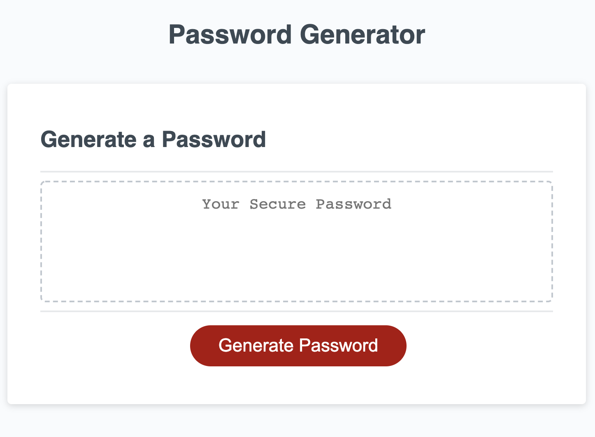

# Password Generator README
This project is a simple application that generates a password according to the criteria specified by the user. 

The user starts the program by selecting the “Generate Password” button. Then the user is guided through a series of password criteria listed below where the user must select at least one type of character for the password (e.g. lowercase, uppercase, numeric or special characters).
1. Number of characters in the password (Between 8 and 128)
2. Includes lowercase characters
3. Includes uppercase characters
4. Includes numeric characters 
5. Includes special characters

The program then displays the generated password to the screen in place of the text “Your Secure Password”.

Here is a link to the live application: https://ayfor.github.io/password_generator/

